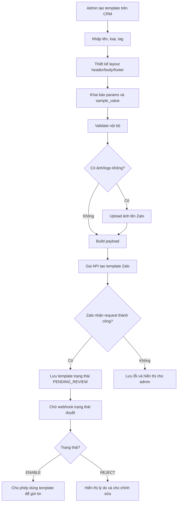

# TÀI LIỆU PHÂN TÍCH API TẠO TEMPLATE ZALO ZBS/ZNS

**Mục đích tài liệu:**  
Tài liệu này dùng để phân tích API **Tạo Template** của Zalo ZBS/ZNS, phục vụ cho AI/Developer triển khai chức năng quản lý template trong hệ thống CRM có tích hợp Zalo OA.

**Tài liệu tham khảo chính:**  
https://developers.zalo.me/docs/zbs-template-message/quan-ly-template/template-api/api-tao-template

---

## 1. Tổng quan API Tạo Template

API **Tạo Template** dùng để hệ thống tạo mẫu tin nhắn ZBS/ZNS trực tiếp bằng API, thay vì tạo thủ công trên giao diện Zalo Business.

Template sau khi tạo **không được dùng gửi ngay**, mà phải chờ Zalo kiểm duyệt. Sau khi template được duyệt và chuyển sang trạng thái có thể sử dụng, hệ thống mới được dùng `template_id` để gửi tin template cho khách hàng.

### 1.1. Vai trò trong hệ thống CRM

Trong hệ thống CRM/Zalo OA, API này nên được dùng cho module:

```text
Quản lý Template Zalo
- Tạo template mới
- Lưu nháp template
- Gửi template lên Zalo để duyệt
- Theo dõi trạng thái duyệt
- Chỉnh sửa template bị từ chối
- Đồng bộ danh sách template từ Zalo
- Chỉ cho phép gửi tin bằng template đã được duyệt
```

### 1.2. Phân biệt với API gửi tin template

| Nhóm API | Mục đích | Kết quả |
|---|---|---|
| API Tạo Template | Đăng ký mẫu tin với Zalo | Template chờ duyệt |
| API Gửi Template | Gửi tin theo template đã duyệt | Tin gửi tới khách hàng |
| API Lấy danh sách Template | Đồng bộ template về CRM | Danh sách template |
| API Lấy chi tiết Template | Xem cấu hình template | Thông tin chi tiết template |

> Lưu ý quan trọng: **API tạo template không phải API gửi tin**. Template phải được Zalo duyệt trước khi dùng để gửi.

---

## 2. Endpoint API

### 2.1. Endpoint tạo template

```http
POST https://business.openapi.zalo.me/template/create
```

### 2.2. Header

```http
Content-Type: application/json
access_token: <OA_ACCESS_TOKEN>
```

### 2.3. Ghi chú kiến trúc

Đây là API thuộc nhóm **Business OpenAPI**, nên nên tách riêng client xử lý:

```text
ZaloOpenApiClient
- Dùng cho OA Chat
- Dùng cho user/getlist
- Dùng cho user/detail
- Dùng cho gửi tin tư vấn

ZaloBusinessApiClient
- Dùng cho ZBS/ZNS template
- Dùng cho tạo template
- Dùng cho sửa template
- Dùng cho gửi template qua số điện thoại
- Dùng cho lấy danh sách template
```

---

## 3. Request Body chính

Body tạo template thường gồm các nhóm trường sau:

```json
{
  "template_name": "Xác nhận đơn hàng",
  "template_type": "1",
  "tag": "1",
  "layout": [],
  "params": [],
  "note": "Template dùng để xác nhận đơn hàng sau khi khách đặt hàng thành công."
}
```

### 3.1. Bảng mô tả field

| Field | Bắt buộc | Kiểu dữ liệu | Ý nghĩa |
|---|---:|---|---|
| `template_name` | Có | string | Tên template để quản lý |
| `template_type` | Có | string/number | Loại template |
| `tag` | Có | string | Nhóm mục đích gửi tin |
| `layout` | Có | array | Cấu trúc hiển thị template |
| `params` | Không | array | Danh sách biến động trong template |
| `note` | Không | string | Ghi chú gửi cho bộ phận kiểm duyệt |

---

## 4. Phân tích `template_name`

`template_name` là tên dùng để định danh template trong hệ thống Zalo và trong CRM.

### 4.1. Ví dụ tên template

```text
Xác nhận đơn hàng
Nhắc lịch hẹn khám
Thông báo thanh toán thành công
Thông báo giao hàng
Yêu cầu đánh giá dịch vụ
Gửi mã OTP xác thực
```

### 4.2. Rule đề xuất trong CRM

```text
- Không được rỗng.
- Nên giới hạn độ dài.
- Không nên đặt tên quá chung chung như “Template 1”.
- Không nên trùng tên trong cùng một OA.
- Tên nên phản ánh đúng mục đích gửi tin.
```

### 4.3. Validation backend

```ts
if (!templateName || templateName.trim().length === 0) {
  throw new Error("TEMPLATE_NAME_REQUIRED");
}
```

---

## 5. Phân tích `template_type`

`template_type` dùng để xác định loại template. Mỗi loại template sẽ có quy định riêng về cấu trúc, nội dung, layout và biến.

### 5.1. Enum nội bộ đề xuất

```ts
export enum ZaloTemplateType {
  CUSTOM = "1",
  AUTHENTICATION = "2",
  PAYMENT_REQUEST = "3",
  VOUCHER = "4",
  SERVICE_RATING = "5"
}
```

### 5.2. Ý nghĩa nghiệp vụ

| template_type | Tên gợi ý | Dùng khi nào |
|---|---|---|
| `1` | Custom | Đơn hàng, lịch hẹn, thông báo giao dịch |
| `2` | Authentication | OTP, mã xác thực |
| `3` | Payment Request | Yêu cầu thanh toán, nhắc thanh toán |
| `4` | Voucher | Gửi mã ưu đãi/voucher |
| `5` | Service Rating | Mời đánh giá dịch vụ |

### 5.3. Rule đề xuất

```text
- Backend phải validate template_type nằm trong enum cho phép.
- Không cho frontend truyền giá trị tự do.
- Mỗi template_type nên có form builder/layout rule riêng.
```

Ví dụ:

```ts
const allowedTypes = ["1", "2", "3", "4", "5"];

if (!allowedTypes.includes(input.templateType)) {
  throw new Error("INVALID_TEMPLATE_TYPE");
}
```

---

## 6. Phân tích `tag`

`tag` dùng để phân loại mục đích gửi tin.

### 6.1. Enum nội bộ đề xuất

```ts
export enum ZaloTemplateTag {
  TRANSACTION = "1",
  CUSTOMER_CARE = "2",
  PROMOTION = "3"
}
```

### 6.2. Ý nghĩa nghiệp vụ

| tag | Nhóm | Ví dụ nội dung |
|---|---|---|
| `1` | Giao dịch | Xác nhận đơn hàng, thanh toán, lịch hẹn |
| `2` | Chăm sóc khách hàng | Nhắc lịch, cập nhật trạng thái, bảo hành |
| `3` | Hậu mãi/khuyến mãi | Voucher, ưu đãi, chương trình chăm sóc |

### 6.3. Lưu ý kiểm duyệt

Template có `tag` giao dịch không nên chứa nội dung quảng cáo quá mạnh. Nếu template là thông báo đơn hàng, nội dung cần tập trung vào thông tin giao dịch như mã đơn, trạng thái, thời gian, số tiền.

Ví dụ nên dùng:

```text
Đơn hàng {{order_code}} của anh/chị đã được xác nhận. Tổng tiền: {{amount}}.
```

Ví dụ không nên dùng trong template giao dịch:

```text
Đơn hàng đã xác nhận. Nhân dịp này, hãy mua thêm combo khuyến mãi giảm 50%.
```

---

## 7. Phân tích `layout`

`layout` là phần quan trọng nhất của API tạo template. Đây là cấu trúc hiển thị của template.

Một template thường có 3 phần chính:

```text
HEADER
BODY
FOOTER
```

Ví dụ cấu trúc tổng quát:

```json
[
  {
    "type": "HEADER",
    "components": []
  },
  {
    "type": "BODY",
    "components": []
  },
  {
    "type": "FOOTER",
    "components": []
  }
]
```

### 7.1. HEADER

Header là phần đầu template. Có thể dùng để hiển thị logo, banner hoặc hình ảnh.

Ví dụ header có logo:

```json
{
  "type": "HEADER",
  "components": [
    {
      "type": "LOGO",
      "mediaSystemId": "media_123456"
    }
  ]
}
```

Ví dụ header có ảnh:

```json
{
  "type": "HEADER",
  "components": [
    {
      "type": "IMAGE",
      "mediaSystemId": "media_123456"
    }
  ]
}
```

### 7.2. BODY

Body là phần nội dung chính. Đây là phần bắt buộc nên có.

Các component thường dùng:

```text
TITLE
PARAGRAPH
TABLE
OTP
VOUCHER
PAYMENT
IMAGE
```

Ví dụ body đơn giản:

```json
{
  "type": "BODY",
  "components": [
    {
      "type": "TITLE",
      "text": "Xác nhận đơn hàng"
    },
    {
      "type": "PARAGRAPH",
      "text": "Xin chào {{customer_name}}, đơn hàng {{order_code}} của bạn đã được ghi nhận."
    }
  ]
}
```

Ví dụ body có bảng thông tin:

```json
{
  "type": "BODY",
  "components": [
    {
      "type": "TITLE",
      "text": "Thông tin đơn hàng"
    },
    {
      "type": "TABLE",
      "items": [
        {
          "key": "Mã đơn hàng",
          "value": "{{order_code}}"
        },
        {
          "key": "Tổng tiền",
          "value": "{{amount}}"
        },
        {
          "key": "Ngày đặt",
          "value": "{{order_date}}"
        }
      ]
    }
  ]
}
```

### 7.3. FOOTER

Footer thường dùng cho ghi chú hoặc button CTA.

Ví dụ footer có nút mở URL:

```json
{
  "type": "FOOTER",
  "components": [
    {
      "type": "BUTTONS",
      "items": [
        {
          "title": "Xem chi tiết",
          "type": "OPEN_URL",
          "content": "https://example.com/orders/{{order_code}}"
        }
      ]
    }
  ]
}
```

### 7.4. Rule validate layout

Backend cần validate layout trước khi gọi Zalo:

```text
- layout phải là array.
- layout phải có BODY.
- BODY phải có ít nhất một component nội dung.
- Component type phải nằm trong danh sách cho phép.
- Nếu dùng biến {{param_name}}, biến đó phải tồn tại trong params.
- Nếu dùng mediaSystemId, media đó phải tồn tại trong DB hoặc đã upload lên Zalo.
- Nếu button là OPEN_URL, content phải là URL hợp lệ.
- Không cho truyền JSON layout không kiểm soát từ frontend nếu chưa validate.
```

---

## 8. Phân tích `params`

`params` là danh sách biến động được sử dụng trong template.

Ví dụ nội dung template:

```text
Xin chào {{customer_name}}, đơn hàng {{order_code}} của bạn có tổng tiền {{amount}}.
```

Thì `params` cần có:

```json
[
  {
    "name": "customer_name",
    "type": "CUSTOMER_NAME",
    "sample_value": "Nguyễn Văn A"
  },
  {
    "name": "order_code",
    "type": "ORDER_CODE",
    "sample_value": "DH000123"
  },
  {
    "name": "amount",
    "type": "AMOUNT",
    "sample_value": "500000"
  }
]
```

### 8.1. Cấu trúc field trong params

| Field | Ý nghĩa |
|---|---|
| `name` | Tên biến dùng trong layout |
| `type` | Loại dữ liệu/ngữ nghĩa của biến |
| `sample_value` | Giá trị mẫu để Zalo kiểm duyệt |

### 8.2. Quy tắc đặt tên biến

```text
- Dùng tiếng Anh không dấu.
- Dùng snake_case.
- Không chứa khoảng trắng.
- Không chứa ký tự đặc biệt.
- Không bắt đầu bằng số.
```

Ví dụ tốt:

```text
customer_name
order_code
amount
appointment_date
appointment_time
doctor_name
payment_link
```

Ví dụ không tốt:

```text
tên khách hàng
ma don hang
1amount
order-code
```

### 8.3. Validate chéo layout và params

Backend cần scan toàn bộ biến trong layout:

```regex
/{{\s*([a-zA-Z0-9_]+)\s*}}/g
```

Sau đó so sánh với danh sách params.

Ví dụ lỗi:

```json
{
  "text": "Xin chào {{customer_name}}, đơn hàng {{order_id}} đã tạo thành công."
}
```

Nhưng params chỉ có:

```json
[
  {
    "name": "customer_name",
    "type": "CUSTOMER_NAME",
    "sample_value": "Nguyễn Văn A"
  }
]
```

Lỗi cần báo:

```text
Thiếu khai báo biến order_id trong params.
```

### 8.4. Pseudo code scan params

```ts
function extractParamsFromLayout(layout: unknown): string[] {
  const text = JSON.stringify(layout);
  const regex = /{{\s*([a-zA-Z0-9_]+)\s*}}/g;
  const params = new Set<string>();

  let match;
  while ((match = regex.exec(text)) !== null) {
    params.add(match[1]);
  }

  return Array.from(params);
}

function validateParams(layout: unknown, params: Array<{ name: string }>) {
  const usedParams = extractParamsFromLayout(layout);
  const declaredParams = params.map(p => p.name);

  const missingParams = usedParams.filter(p => !declaredParams.includes(p));
  const unusedParams = declaredParams.filter(p => !usedParams.includes(p));

  if (missingParams.length > 0) {
    throw new Error(`Missing params: ${missingParams.join(", ")}`);
  }

  return {
    usedParams,
    unusedParams
  };
}
```

---

## 9. Phân tích `note`

`note` là ghi chú gửi cho bộ phận kiểm duyệt Zalo. Trường này không bắt buộc, nhưng nên có.

### 9.1. Mục đích

```text
- Giải thích template dùng cho nghiệp vụ gì.
- Giải thích thời điểm gửi template.
- Giải thích nguồn dữ liệu của các biến.
- Giúp Zalo duyệt template dễ hơn.
```

### 9.2. Ví dụ note tốt

```text
Template dùng để gửi thông báo xác nhận đơn hàng sau khi khách đặt hàng thành công trên website. Các biến order_code, amount, order_date được lấy từ hệ thống quản lý đơn hàng.
```

```text
Template dùng để nhắc lịch hẹn khám cho khách hàng đã đặt lịch tại phòng khám. Tin được gửi trước lịch hẹn 24 giờ.
```

### 9.3. Ví dụ note không tốt

```text
Dùng để gửi khách.
```

```text
Template test.
```

---

## 10. Request mẫu đầy đủ

### 10.1. Payload nội bộ từ frontend gửi backend

```json
{
  "oaId": "1298383097840805544",
  "templateName": "Xác nhận đơn hàng",
  "templateType": "1",
  "tag": "1",
  "layout": [
    {
      "type": "HEADER",
      "components": [
        {
          "type": "LOGO",
          "mediaSystemId": "media_123456"
        }
      ]
    },
    {
      "type": "BODY",
      "components": [
        {
          "type": "TITLE",
          "text": "Xác nhận đơn hàng"
        },
        {
          "type": "PARAGRAPH",
          "text": "Xin chào {{customer_name}}, đơn hàng {{order_code}} của bạn đã được ghi nhận."
        },
        {
          "type": "TABLE",
          "items": [
            {
              "key": "Mã đơn",
              "value": "{{order_code}}"
            },
            {
              "key": "Tổng tiền",
              "value": "{{amount}}"
            }
          ]
        }
      ]
    },
    {
      "type": "FOOTER",
      "components": [
        {
          "type": "BUTTONS",
          "items": [
            {
              "title": "Xem đơn hàng",
              "type": "OPEN_URL",
              "content": "https://example.com/orders/{{order_code}}"
            }
          ]
        }
      ]
    }
  ],
  "params": [
    {
      "name": "customer_name",
      "type": "CUSTOMER_NAME",
      "sample_value": "Nguyễn Văn A"
    },
    {
      "name": "order_code",
      "type": "ORDER_CODE",
      "sample_value": "DH000123"
    },
    {
      "name": "amount",
      "type": "AMOUNT",
      "sample_value": "500000"
    }
  ],
  "note": "Template dùng để thông báo xác nhận đơn hàng sau khi khách đặt hàng thành công."
}
```

### 10.2. Payload backend gửi Zalo

```json
{
  "template_name": "Xác nhận đơn hàng",
  "template_type": "1",
  "tag": "1",
  "layout": [],
  "params": [],
  "note": "Template dùng để thông báo xác nhận đơn hàng sau khi khách đặt hàng thành công."
}
```

> Trong code thật, `layout` và `params` phải giữ đúng cấu trúc Zalo yêu cầu. Không được để array rỗng như ví dụ minh họa nếu template thật có nội dung.

---

## 11. Flow tạo template chuẩn



---

## 12. Database Design đề xuất

### 12.1. Bảng `zalo_templates`

```sql
CREATE TABLE zalo_templates (
    id UUID PRIMARY KEY,
    oa_id VARCHAR(50) NOT NULL,
    zalo_template_id VARCHAR(100),
    template_name VARCHAR(255) NOT NULL,
    template_type VARCHAR(50) NOT NULL,
    tag VARCHAR(50) NOT NULL,
    status VARCHAR(50) NOT NULL DEFAULT 'DRAFT',
    layout JSONB NOT NULL,
    params JSONB,
    note TEXT,
    preview_url TEXT,
    raw_request JSONB,
    raw_response JSONB,
    zalo_error_code VARCHAR(50),
    zalo_error_message TEXT,
    submitted_at TIMESTAMP,
    approved_at TIMESTAMP,
    rejected_at TIMESTAMP,
    created_by UUID,
    updated_by UUID,
    created_at TIMESTAMP DEFAULT NOW(),
    updated_at TIMESTAMP DEFAULT NOW()
);
```

### 12.2. Bảng `zalo_template_status_events`

```sql
CREATE TABLE zalo_template_status_events (
    id UUID PRIMARY KEY,
    oa_id VARCHAR(50),
    template_id VARCHAR(100),
    old_status VARCHAR(50),
    new_status VARCHAR(50),
    reason TEXT,
    raw_event JSONB,
    created_at TIMESTAMP DEFAULT NOW()
);
```

### 12.3. Bảng `zalo_template_media`

```sql
CREATE TABLE zalo_template_media (
    id UUID PRIMARY KEY,
    oa_id VARCHAR(50) NOT NULL,
    template_id UUID,
    file_name VARCHAR(255),
    file_url TEXT,
    media_system_id VARCHAR(100),
    media_type VARCHAR(50),
    raw_response JSONB,
    created_at TIMESTAMP DEFAULT NOW()
);
```

---

## 13. Trạng thái template nội bộ

### 13.1. Enum đề xuất

```ts
export enum ZaloTemplateStatus {
  DRAFT = "DRAFT",
  PENDING_REVIEW = "PENDING_REVIEW",
  ENABLE = "ENABLE",
  REJECT = "REJECT",
  DISABLE = "DISABLE",
  DELETE = "DELETE",
  FAILED = "FAILED"
}
```

### 13.2. Ý nghĩa trạng thái

| Trạng thái | Ý nghĩa | CRM xử lý |
|---|---|---|
| `DRAFT` | Mới lưu nội bộ, chưa gửi Zalo | Cho chỉnh sửa tự do |
| `PENDING_REVIEW` | Đã gửi Zalo, chờ duyệt | Khóa chỉnh sửa hoặc chỉ cho tạo bản mới |
| `ENABLE` | Đã duyệt | Cho phép dùng để gửi tin |
| `REJECT` | Bị từ chối | Hiển thị lý do, cho chỉnh sửa và gửi lại |
| `DISABLE` | Bị tạm dừng | Không cho gửi |
| `DELETE` | Đã xóa | Ẩn khỏi danh sách gửi |
| `FAILED` | Gọi API lỗi | Cho sửa lỗi và retry |

---

## 14. Backend API nội bộ nên có

### 14.1. Lưu nháp template

```http
POST /api/zalo/templates/draft
```

Dùng khi admin đang thiết kế template nhưng chưa gửi lên Zalo.

### 14.2. Tạo template và gửi duyệt

```http
POST /api/zalo/templates
```

Flow:

```text
1. Validate input.
2. Upload media nếu có.
3. Build payload.
4. Gọi Zalo API /template/create.
5. Lưu raw_request/raw_response.
6. Set status = PENDING_REVIEW nếu thành công.
7. Trả kết quả về frontend.
```

### 14.3. Lấy danh sách template

```http
GET /api/zalo/templates?oaId=xxx&status=&keyword=&page=1&pageSize=20
```

### 14.4. Lấy chi tiết template

```http
GET /api/zalo/templates/{id}
```

### 14.5. Gửi lại template bị reject

```http
POST /api/zalo/templates/{id}/resubmit
```

### 14.6. Webhook trạng thái template

```http
POST /api/zalo/webhook/template-status
```

---

## 15. Service Layer đề xuất

```text
src/modules/zalo-template/
  controllers/
    zalo-template.controller.ts
    zalo-template-webhook.controller.ts

  services/
    zalo-template.service.ts
    zalo-template-validation.service.ts
    zalo-template-layout.service.ts
    zalo-template-media.service.ts
    zalo-business-api-client.ts
    zalo-token.service.ts

  repositories/
    zalo-template.repository.ts
    zalo-template-status-event.repository.ts
    zalo-template-media.repository.ts

  dto/
    create-zalo-template.dto.ts
    update-zalo-template-draft.dto.ts
    submit-zalo-template.dto.ts

  enums/
    zalo-template-type.enum.ts
    zalo-template-tag.enum.ts
    zalo-template-status.enum.ts
    zalo-template-component-type.enum.ts
```

---

## 16. ZaloBusinessApiClient đề xuất

```ts
export class ZaloBusinessApiClient {
  async createTemplate(accessToken: string, payload: unknown) {
    const res = await fetch("https://business.openapi.zalo.me/template/create", {
      method: "POST",
      headers: {
        "Content-Type": "application/json",
        access_token: accessToken
      },
      body: JSON.stringify(payload)
    });

    const data = await res.json();

    if (!res.ok || data.error) {
      throw new ZaloBusinessApiException(data.error, data.message, data);
    }

    return data;
  }
}
```

---

## 17. Use Case: Tạo template đơn hàng

### 17.1. Bối cảnh

Admin muốn tạo template gửi thông báo xác nhận đơn hàng cho khách hàng sau khi đặt hàng thành công.

### 17.2. Dữ liệu nhập

```text
Tên template: Xác nhận đơn hàng
Loại template: Custom
Tag: Giao dịch
Biến: customer_name, order_code, amount, order_date
```

### 17.3. Nội dung template

```text
Xin chào {{customer_name}}, đơn hàng {{order_code}} của anh/chị đã được ghi nhận.
Tổng tiền: {{amount}}
Ngày đặt: {{order_date}}
```

### 17.4. Expected result

```text
- Template được lưu vào database với status = DRAFT khi lưu nháp.
- Khi gửi duyệt thành công, status = PENDING_REVIEW.
- Khi Zalo duyệt, status = ENABLE.
- Chỉ khi status = ENABLE, template mới được hiển thị ở màn hình gửi tin.
```

---

## 18. Validation checklist trước khi gọi Zalo

```text
1. template_name không rỗng.
2. template_type nằm trong enum cho phép.
3. tag nằm trong enum cho phép.
4. layout là array.
5. layout có BODY.
6. BODY có ít nhất TITLE hoặc PARAGRAPH.
7. Các biến {{param_name}} trong layout phải tồn tại trong params.
8. params phải có sample_value.
9. sample_value phải hợp lý theo type.
10. Nếu layout dùng ảnh/logo thì mediaSystemId phải tồn tại.
11. Nếu footer có button URL thì URL phải hợp lệ.
12. note nếu có thì không quá dài theo giới hạn Zalo.
13. Không chứa nội dung quảng cáo trong template giao dịch.
14. Không chứa biến không khai báo.
15. Không gửi tạo template trùng tên nếu CRM đang quản lý cùng OA.
```

---

## 19. Error Mapping đề xuất

| Lỗi | Nguyên nhân | Cách xử lý |
|---|---|---|
| App chưa có quyền | App/OA chưa đăng ký API template | Kiểm tra quyền ZBS/OA/App |
| OA chưa liên kết ZBS | Tài khoản chưa đủ điều kiện dùng ZBS | Liên kết OA với tài khoản ZBS |
| Layout sai cấu trúc | Header/body/footer/component sai format | Validate nội bộ trước |
| Thiếu params | Layout có biến nhưng params không khai báo | Tự động scan biến và cảnh báo |
| Media không hợp lệ | Ảnh chưa upload lên Zalo hoặc sai media id | Upload ảnh trước |
| Template bị reject | Nội dung không đúng chính sách hoặc thiếu ngữ cảnh | Hiển thị lý do và cho chỉnh sửa |
| Token hết hạn | Access token không còn hợp lệ | Refresh token rồi retry một lần |

### 19.1. Response lỗi nội bộ mẫu

```json
{
  "success": false,
  "error": {
    "code": "ZALO_TEMPLATE_LAYOUT_INVALID",
    "message": "Cấu trúc layout template không hợp lệ.",
    "zaloErrorCode": -999,
    "zaloMessage": "Invalid layout"
  }
}
```

---

## 20. Prompt cho AI code

```text
Bạn là senior backend/fullstack developer. Hãy xây dựng module Zalo Template Management cho CRM tích hợp Zalo OA.

Tài liệu API chính:
- POST https://business.openapi.zalo.me/template/create
- Header: access_token, Content-Type: application/json

Yêu cầu kiến trúc:
- Frontend không gọi trực tiếp Zalo API.
- Backend là trung gian gọi Zalo Business OpenAPI.
- Token OA/ZBS lưu ở backend/database, không expose ra frontend.
- Hỗ trợ nhiều OA theo oaId.
- Template phải có trạng thái nội bộ: DRAFT, PENDING_REVIEW, ENABLE, REJECT, DISABLE, DELETE, FAILED.
- Chỉ template ENABLE mới được dùng để gửi tin.

Database cần có:
1. zalo_templates
2. zalo_template_status_events
3. zalo_template_media

Backend API nội bộ cần có:
1. POST /api/zalo/templates/draft
2. POST /api/zalo/templates
3. GET /api/zalo/templates
4. GET /api/zalo/templates/:id
5. POST /api/zalo/templates/:id/resubmit
6. POST /api/zalo/webhook/template-status

Service cần có:
- ZaloTemplateService
- ZaloTemplateValidationService
- ZaloTemplateLayoutService
- ZaloTemplateMediaService
- ZaloBusinessApiClient
- ZaloTokenService

Luồng tạo template:
1. Nhận request từ frontend.
2. Validate template_name, template_type, tag.
3. Validate layout có BODY và component hợp lệ.
4. Scan biến {{param_name}} trong layout.
5. Validate params khai báo đầy đủ biến đang dùng.
6. Validate sample_value không rỗng.
7. Nếu layout có ảnh/logo, kiểm tra mediaSystemId.
8. Build payload Zalo.
9. Lưu raw_request vào DB.
10. Gọi Zalo API /template/create.
11. Nếu thành công, lưu zalo_template_id nếu có và status = PENDING_REVIEW.
12. Nếu lỗi, lưu status = FAILED, zalo_error_code, zalo_error_message.
13. Trả response chuẩn cho frontend.

Yêu cầu frontend:
- Có màn hình danh sách template.
- Có màn hình tạo/sửa template.
- Cho chọn OA.
- Cho chọn template_type.
- Cho chọn tag.
- Cho thiết kế layout header/body/footer.
- Cho khai báo params và sample_value.
- Có preview nội bộ.
- Có nút lưu nháp.
- Có nút gửi duyệt Zalo.
- Hiển thị trạng thái template và lý do reject nếu có.

Không cho frontend nhập JSON layout tự do mà không validate. Backend phải validate lại toàn bộ trước khi gọi Zalo.
```

---

## 21. Kết luận triển khai

Không nên làm chức năng tạo template theo kiểu một form JSON rồi bắn thẳng lên Zalo. Nên xây thành module đầy đủ:

```text
Zalo Template Builder
- Chọn OA
- Chọn loại template
- Chọn tag
- Thiết kế layout
- Khai báo biến động
- Nhập sample data
- Upload ảnh/logo
- Preview nội bộ
- Validate
- Gửi duyệt Zalo
- Nhận webhook trạng thái
- Chỉ cho gửi khi template ENABLE
```

Tách rõ 3 phần trong CRM:

```text
1. Template Management
   Tạo, sửa, gửi duyệt, đồng bộ trạng thái template.

2. Template Sending
   Gửi template đã duyệt cho khách qua số điện thoại hoặc user phù hợp.

3. Template Tracking
   Lưu msg_id, tracking_id, trạng thái gửi, trạng thái nhận, webhook delivery.
```

Điểm quan trọng nhất khi code:

```text
- Validate layout + params thật kỹ trước khi gọi Zalo.
- Lưu trạng thái PENDING_REVIEW/ENABLE/REJECT.
- Xử lý webhook thay đổi trạng thái template sau kiểm duyệt.
- Chỉ cho gửi tin bằng template đã ENABLE.
```
